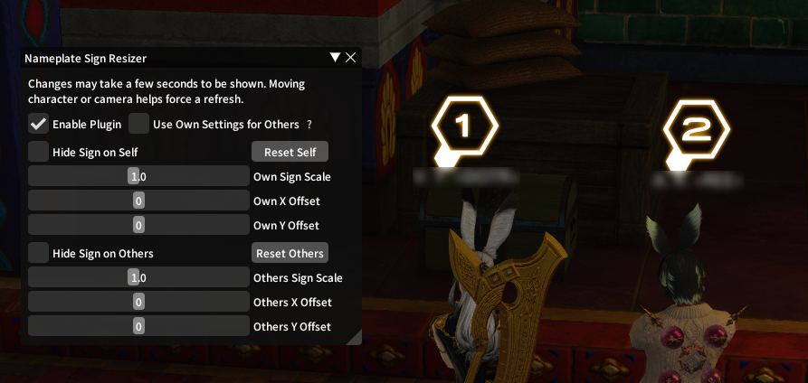
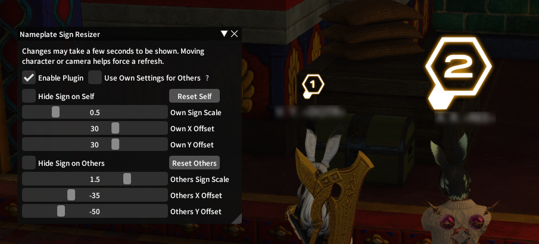

# NameplateSignResizer
* Nameplate signs can be annoying or distracting in their default location above your head. This plugin fixes that issue by giving you complete control over size and positioning; you can even hide the icon entirely if you want!
* Disabled in PvP

### Before and After

# TODO
* [ ] Fix bug causing settings for other players to also apply to some NPC quest markers.
* [ ] Add an option to automatically center icon when scale changes.
